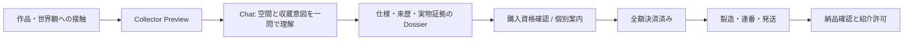

# ジャケット・メタルプリント VIP Edition — 月次完売戦略

更新日: 2026-07-18
状態: `CANDIDATE_STRATEGY / NOT_FOR_PUBLICATION_OR_SALE`

## North Star

ジャケットアートを用いた **公開基準価格¥330,000（税込）／Collector Preview Price ¥300,000（税込）のメタルプリント、各エディション3枚限定**を、毎月すべて完売させる。

3枚限定を事実として守るなら、「月10件以上を売り切る」の最小単位は10件ではない。月4エディション × 各3枚 = **12件**である。

| 月次カプセル | エディション数 | 1エディション | 販売数 | 単価 | 売上目標 |
|---|---:|---:|---:|---:|---:|
| VIP Metal Capsule | 4 | 3枚限定 | 12枚 | ¥300,000 | **¥3,600,000** |

売れ残りを値引きして達成扱いにはしない。売上は、全額決済済みかつ返金・取消対象でない枚数だけで数える。予約・問い合わせ・デポジットは別指標にする。

## 現在地と非交渉条件

現行の交易所にはメタルプリントが2点あるが、価格は `準備中`、決済リンクは未設定で、サイズ・仕上げ・実製造・限定番号も確定していない。従って、今は販売開始ではなく、販売可能なVIP商品を作る段階である。

- 「3枚限定」は、作品画像・トリミング・サイズ・素材・仕上げの組み合わせごとに台帳で固定する。
- 各3枚は `1/3, 2/3, 3/3` と連番化し、売れた後に同一仕様を増刷しない。
- レンダー画像はレンダーと明記する。実物写真、色味、金属面の反射、傷リスクは事実だけを示す。
- 権利者、原画データ、印刷業者、原価、梱包、保険、破損時対応、税・返金・納期が未確定のまま売らない。
- 希少性は台帳で証明できる範囲だけで伝える。架空の残数・待機者・完売を表示しない。

## 商品の定義

商品は「ジャケット画像のプリント」ではなく、音楽の世界を物理空間へ移す **収蔵可能な作品**として定義する。

一作品ごとに、公開前に次をロックする。

| 項目 | 必須内容 |
|---|---|
| Edition ID | 例: `VIP-METAL-2026-08-A`。月・作品・版を一意に識別するID |
| 原作 | ジャケット作品名、制作年、原画の権利状態 |
| 物理仕様 | 実寸、素材、厚み、仕上げ、取付方法、重量、額装有無 |
| Edition | 3枚、連番、署名・証明書の有無、再版方針 |
| 価格とコスト | 公開基準価格¥330,000／Collector Preview Price ¥300,000の可否、製造・梱包・保険・送料・決済手数料・粗利 |
| 納品 | 製造開始条件、納期、配送地域、破損・再製造・返品方針 |
| 証拠 | 実物試作写真、色校正、Certificate of Authenticity の雛形 |

公開コピーの骨子は次の順序に固定する。

1. 何か: 「ジャケットアートを、3枚だけのメタル作品として」
2. なぜ今か: その作品が生まれた背景と、壁に置く意味
3. 何が届くか: 実寸・素材・仕上げ・証明書・納期
4. 何が限定か: edition identity と 3枚の根拠
5. 次の一歩: 購入ではなく、まずコレクター・プレビューまたは作品仕様を見る

## VIP販売ファネル

Chatは高額商品の唯一の集客源にはしない。作品への関心を深め、適切な人をコレクター導線へ渡す役割に限定する。

### 月次の初期ファネル仮説

これは実測前の運用仮説であり、成約率の約束ではない。高単価品のため、広いPVを追うより、収蔵意図がある相手の質を優先する。

| 段階 | 月次必要数 | 定義 |
|---|---:|---|
| Named collector prospects | 150 | 過去購入者、アート収集家、建築・空間・ホテル・ギャラリー等。許諾済みの連絡先のみ |
| Preview opt-in | 60 | カプセル先行案内を希望した人 |
| Dossier閲覧・相談 | 36 | 仕様・来歴・実物証拠を確認した人 |
| 購入意向確認 | 20 | 購入条件と納期を理解した人 |
| 全額決済 | 12 | 4エディションが各3/3となった状態 |

週次の下限は、preview opt-in 15、dossier 9、購入意向確認 5、決済 3。1週でも決済0なら、「作品・証拠・対象顧客・導線・価格帯」のどこで失速したかを監査する。価格は専用ポリシーで委任された ¥330,000 / ¥300,000 / ¥165,000 の帯域と、月4件の半額枠に従って自律選択する。

## Chatの役割

### 検知する意図

`メタルプリント / ジャケット / アートを飾る / コレクション / 限定作品 / インテリア / ギャラリー / ホテル / 空間 / 贈答 / collector` などを検知候補とする。

### 会話の型

1. 伯爵が、相手が惹かれた作品・空間・時間を一度だけ言い換える。
2. 「どの空間に、この作品を置きたいですか」と一問だけ尋ねる。
3. 合致した場合のみ、該当EditionのDossierへ案内する。
4. 購入判断に必要な実仕様・価格・納期・限定数を明示する。
5. 売り込まない。相手が収蔵意図を示していない場合は、展示や作品ページへ戻す。

ChatのCTAは候補段階では `コレクター・プレビューを申し込む`、販売開始後は `仕様を確認して購入へ進む` とする。`残りわずか` は台帳の実残数をサーバーで確認できる場合だけ使う。

### 必要な計測イベント

- `metal_capsule_view`
- `metal_dossier_open`（editionId）
- `metal_preview_opt_in`（editionId）
- `metal_chat_qualified`（collectorIntent。会話本文は送らない）
- `metal_purchase_intent`（editionId）
- `metal_checkout_start`（editionId）
- `metal_payment_completed`（editionId、決済Webhookのみ）
- `metal_edition_sold_out`（editionId、3/3決済後のみ）

## CRO仕様: 専用ランディングページ

現在の交易所カードをそのまま¥300,000へ差し替えない。1カプセル1ページの専用ページを作る。

### Above the fold

- H1候補: `ジャケットアートを、3枚だけのメタル作品として。`
- サブコピー: 作品名、edition size、実際の物理仕様、価格、納期を一文で明示
- 主CTA: `コレクター・プレビューを申し込む`
- 副CTA: `仕様と来歴を見る`
- 実物画像または、レンダーであることを明記した画像

### 続くべき証拠

1. 原作ジャケットと物理化する理由
2. 実物・素材・設置状態の写真
3. サイズ、重量、仕上げ、取付、梱包、配送、納期
4. Certificate of Authenticity と連番の扱い
5. 「3枚限定」の根拠と、再版しない仕様
6. 購入前FAQ: 色味、傷、返品、破損、税、海外配送、設置
7. 事実に基づく購入者の声または設置事例。ない段階では捏造しない

## 30日運用サイクル

| 時期 | 自律的に実行してよいこと | Human Approval が必要なこと |
|---|---|---|
| D-30〜D-21 | 候補ジャケット監査、権利・仕様・原価・納期の未確定項目を台帳化、Dossier草案 | 販売作品の最終選定、印刷発注、価格確定 |
| D-20〜D-14 | LP・Chat・メール・SNSの候補コピー、QA、計測設計、プレビュー待機リストの整理 | 外部送信、公開、広告出稿 |
| D-13〜D-7 | 実物証拠の確認、リンク切れ・数量・表記の監査、購入フローのローカル検証 | Stripe Payment Link、在庫台帳の公開連携 |
| D-6〜D-1 | 日次の見込み数監査、個別案内文の下書き、失速箇所の仮説整理 | 個別営業送信、公開開始、決済開始 |
| Launch〜Sold out | 数量・決済・問い合わせの監査、FAQ候補の更新、Dossierの誤記修正案 | 購入承認、返金、発送、完売表示 |
| Post-sale | 売上・原価・納期・破損・紹介許可の監査、次月の改善案 | 次月の版決定、購入者への連絡・公開 |

## 自律運用の停止条件

次のどれかが未確定なら `HOLD` とし、販売導線を進めない。

- 原作・画像の権利が明確でない
- 3枚限定のEdition IDと連番台帳がない
- 物理仕様、原価、納期、破損時対応がない
- 実物証拠がなく、レンダーを実物のように見せる必要がある
- 決済・返金・配送・税の責任者が未確定
- 決済済み枚数を正確に同期できず、残数を事実として表示できない

## 最初の実装Sprint

実装前に、以下の候補パックを作る。販売・公開・Stripe変更は含めない。

1. `VIP-METAL-YYYY-MM-A`〜`D` の4エディション候補台帳
2. 各候補の権利・原画・仕様・原価・納期・実物証拠チェックリスト
3. Collector Dossier のテンプレート
4. 専用LPとChatハンドオフのワイヤーコピー
5. 決済完了だけを販売数にする在庫・Webhook設計
6. 12件完売を基準にした週次スコアカード

このSprintの完了状態は `READY_FOR_HUMAN_APPROVAL_VIP_METAL_CAPSULE`。実物・価格・限定数・決済が承認されるまでは Candidate のまま扱う。
